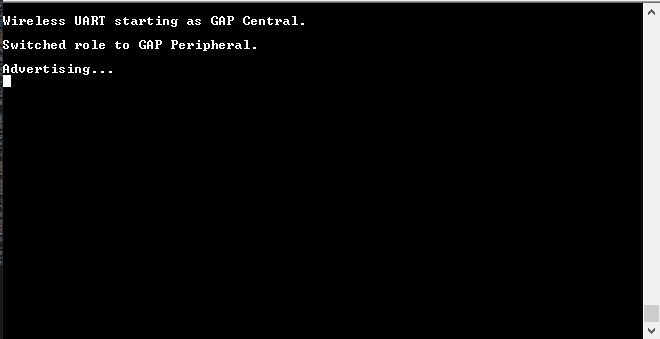
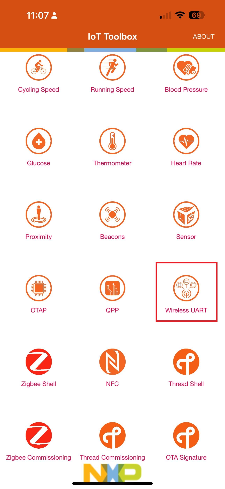
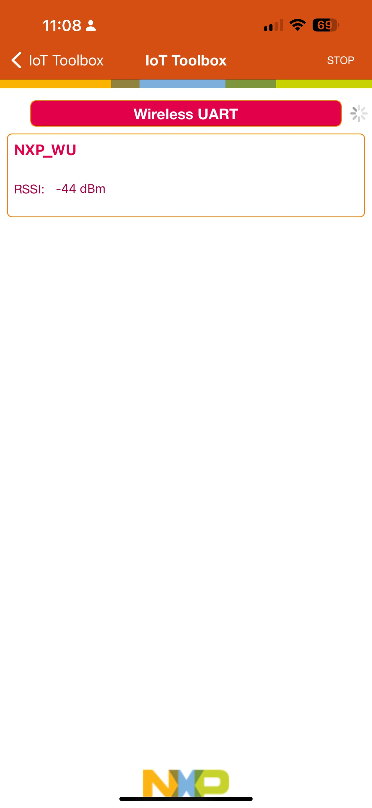
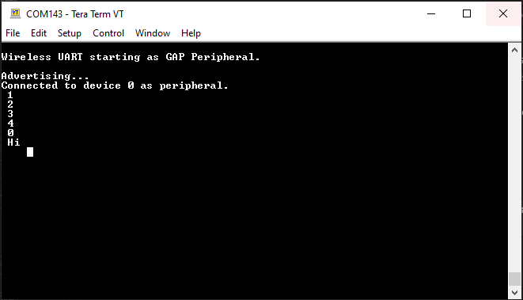
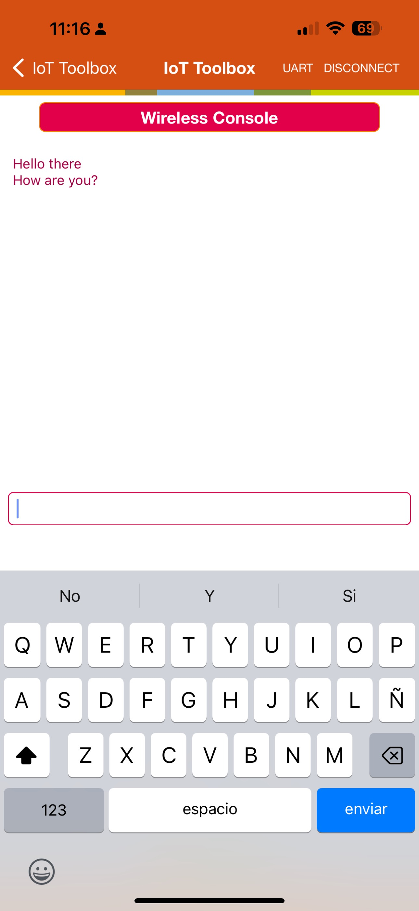
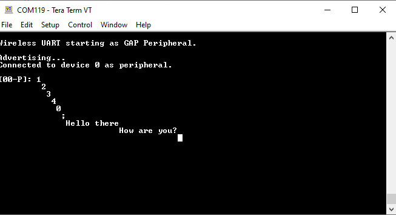

# NXP Application Code Hub
[](https://www.nxp.com)

## Controlling LEDS over BLE Wireless UART on FRDM-MCXW71 
This demo allows the user to interact with the device through a serial terminal. It also gives a possibility to change the LEDs color via a command sent by the IoT Toolbox using a smartphone.


#### Boards: FRDM-MCXW71, FRDM-MCXW7X
#### Categories: Wireless Connectivity
#### Peripherals: GPIO, UART
#### Toolchains: MCUXpresso IDE, IAR

## Table of Contents
1. [Software](#step1)
2. [Hardware](#step2)
3. [Setup](#step3)
4. [Results](#step4)
5. [FAQs](#step5) 
6. [Support](#step6)
7. [Release Notes](#step7)

## 1. Software<a name="step1"></a>
This code is implemented using the MCUXpresso IDE version 11.9.0 and SDK version 2.16.000.


#### Note: 
*To use any wireless example in the MCXW71, upload the NBU image. This image comes into the SDK version that you use in this case:*

- "SDK_2_16_FRDM-MCXW71-> middleware-> wireless-> ble_controller-> bin-> mcxw71_nbu_ble-..-.sb3"

## 2. Hardware<a name="step2"></a>
Purchase the supported board:

- [FRDM-MCXW71](https://www.nxp.com/part/FRDM-MCXW71#/)

 
## 3. Setup<a name="step3"></a>


### 3.1 Step 1
Import the project *"w_uart"* into the MCUXpresso IDE using the following sections of the "MCUXpresso IDE - User Guide" found in the documentation section of the [MCUXpresso IDE page](https://www.nxp.com/design/software/development-software/mcuxpresso-software-and-tools-/mcuxpresso-integrated-development-environment-ide:MCUXpresso-IDE)

#### Note: 
  *To see the Wireless UART in the IoT tool box, change the GAP role in the app:  press SW4 and then SW2.*


  


### 3.2 Step 2
Once the Wireless UART example is imported into your workspace, add the right configurations to enable the LEDs commands. The following sections explain the main aspects that you should focus on:

- wireless_uart.c file

This file is needed to add the declarations, variables, and includes instructions to configure the LEDS commands:

#### Declarations and variables:

```C
uint8_t command_uart;
uint8_t command_lenght;
```

Necessary functions:

It is necessary to declare and create the function to configure the LEDS into the project:

```C
void commandLed(void)
{
	if (command_uart == '1' && command_lenght <= 2)
	{
	     GPIO_PortSet(GPIOA, 1U << 20U);
	     GPIO_PortSet(GPIOA, 1U << 19U);
	     GPIO_PortSet(GPIOA, 1U << 21U);


	    gpio_pin_config_t rgbled_config = {
	        kGPIO_DigitalOutput,
	        0,
	    };

	    PORT_SetPinMux(PORTA, 21U, kPORT_MuxAsGpio);
	     GPIO_PinInit(GPIOA, 21U, &rgbled_config);
	     GPIO_PortClear(GPIOA, 1U << 21U);
	     GPIO_PortSet(GPIOA, 1U << 20U);
	     GPIO_PortSet(GPIOA, 1U << 19U);
	}
	else if (command_uart == '2' && command_lenght <= 2)
	{
	    gpio_pin_config_t rgbled_config = {
	        kGPIO_DigitalOutput,
	        0,
	    };

	    PORT_SetPinMux(PORTA, 20U, kPORT_MuxAsGpio);
	     GPIO_PinInit(GPIOA, 20U, &rgbled_config);
	     GPIO_PortClear(GPIOA, 1U << 20U);
	     GPIO_PortSet(GPIOA, 1U << 19U);
	     GPIO_PortSet(GPIOA, 1U << 21U);

	}
	else if (command_uart == '3' && command_lenght <= 2)
	{
	    gpio_pin_config_t rgbled_config = {
	        kGPIO_DigitalOutput,
	        0,
	    };

	    PORT_SetPinMux(PORTA, 19U, kPORT_MuxAsGpio);
	     GPIO_PinInit(GPIOA, 19U, &rgbled_config);
	     GPIO_PortClear(GPIOA, 1U << 19U);
	     GPIO_PortSet(GPIOA, 1U << 20U);
	     GPIO_PortSet(GPIOA, 1U << 21U);
	}
	else if (command_uart == '0' && command_lenght <= 2)
	{

	    gpio_pin_config_t rgbled_config = {
	        kGPIO_DigitalOutput,
	        0,
	    };

	    PORT_SetPinMux(PORTA, 21U, kPORT_MuxAsGpio);
	    GPIO_PinInit(GPIOA, 19U, &rgbled_config);
	    GPIO_PinInit(GPIOA, 20U, &rgbled_config);
	    GPIO_PinInit(GPIOA, 21U, &rgbled_config);


		GPIO_PortClear(GPIOA, 1U << 20U);
		GPIO_PortClear(GPIOA, 1U << 21U);
		GPIO_PortClear(GPIOA, 1U << 19U);

	}
	else
	{
	    gpio_pin_config_t rgbled_config = {
	        kGPIO_DigitalOutput,
	        0,
	    };

	    PORT_SetPinMux(PORTA, 21U, kPORT_MuxAsGpio);
	    GPIO_PinInit(GPIOA, 19U, &rgbled_config);
	    GPIO_PinInit(GPIOA, 20U, &rgbled_config);
	    GPIO_PinInit(GPIOA, 21U, &rgbled_config);

	    GPIO_PortSet(GPIOA, 1U << 19U);
	    GPIO_PortSet(GPIOA, 1U << 20U);
	    GPIO_PortSet(GPIOA, 1U << 21U);
	}

}
```


The LEDs are used into the Wireless UART examples to let the user interact with the board in a diferefent way. So, it is necessary to call the function in the BLE functionality:


Call the Command LED function in the BLE Receive UART:
```C
static void BleApp_ReceivedUartStream
(
    deviceId_t peerDeviceId,
    uint8_t *pStream,
    uint16_t streamLength
)
```
just after this line:

```C
#if (defined(SERIAL_MANAGER_NON_BLOCKING_MODE) && (SERIAL_MANAGER_NON_BLOCKING_MODE > 0U))
        serial_manager_status_t status = SerialManager_InstallTxCallback((serial_write_handle_t)s_writeHandle, Uart_TxCallBack, pBuffer);
        (void)status;
        assert(kStatus_SerialManager_Success == status);

        (void)SerialManager_WriteNonBlocking((serial_write_handle_t)s_writeHandle, pBuffer, streamLength);
#endif /*SERIAL_MANAGER_NON_BLOCKING_MODE > 0U*/
    }

    CommandLed();

    /* update the previous device ID */
    previousDeviceId = peerDeviceId;
}
```

The commands sent by the user using the smartphone need to be captured in the function: 

```C
static void BleApp_GattServerCallback
(
    deviceId_t deviceId,
    gattServerEvent_t *pServerEvent
)
{
    uint16_t tempMtu = 0;

    switch (pServerEvent->eventType)
    {
        case gEvtAttributeWrittenWithoutResponse_c:
        {
            if (pServerEvent->eventData.attributeWrittenEvent.handle == (uint16_t)value_uart_stream)
            {
            	command_uart = *pServerEvent->eventData.attributeWrittenEvent.aValue;
            	command_lenght = pServerEvent->eventData.attributeWrittenEvent.cValueLength;

                BleApp_ReceivedUartStream(deviceId, pServerEvent->eventData.attributeWrittenEvent.aValue,
                                          pServerEvent->eventData.attributeWrittenEvent.cValueLength);
            }

            break;
        }
        .
        .
        .
    }
    .
    .
    .
}
```


## 4. Running the Demo<a name="step4"></a>
When MCXW71 is powered, it starts the advertising role and you can connect your smartphone using the IoT Toolbox app: 


!

!


Once you connect your phone with the MCXW71, you see this message in the terminal window:



You can send a message from the phone to the terminal: 

!



you can change between screen using "commands":

RGB white (command '0')

RGB red (command '1')

RGB blue (command '2')

RGB green (command '3')

** any other command "RGB OFF"

## 5. FAQs<a name="step5"></a>

## 6. Support<a name="step6"></a>

#### Project Metadata
<!----- Boards ----->
[](https://github.com/search?q=org%3Anxp-appcodehub+FRDM-MCXW71+in%3Areadme&type=Repositories) [](https://github.com/search?q=org%3Anxp-appcodehub+FRDM-MCXW7X+in%3Areadme&type=Repositories)

<!----- Categories ----->
[](https://github.com/search?q=org%3Anxp-appcodehub+wireless_connectivity+in%3Areadme&type=Repositories)

<!----- Peripherals ----->
[](https://github.com/search?q=org%3Anxp-appcodehub+gpio+in%3Areadme&type=Repositories) [](https://github.com/search?q=org%3Anxp-appcodehub+uart+in%3Areadme&type=Repositories)

<!----- Toolchains ----->
[](https://github.com/search?q=org%3Anxp-appcodehub+mcux+in%3Areadme&type=Repositories) [](https://github.com/search?q=org%3Anxp-appcodehub+iar+in%3Areadme&type=Repositories)

Questions regarding the content/correctness of this example can be entered as Issues within this GitHub repository.

>**Warning**: For more general technical questions regarding NXP Microcontrollers and the difference in expected functionality, enter your questions on the [NXP Community Forum](https://community.nxp.com/)

[](https://www.youtube.com/@NXP_Semiconductors)
[](https://www.linkedin.com/company/nxp-semiconductors)
[](https://www.facebook.com/nxpsemi/)
[](https://twitter.com/NXP)

## 7. Release Notes<a name="step7"></a>
| Version | Description / Update                           | Date                        |
|:-------:|------------------------------------------------|----------------------------:|
| 1.0     | Initial release on Application Code Hub        | June 12<sup>th</sup> 2024 |
| 2.0     | Language and style corrections                 | October 24<sup>th</sup> 2024 |


